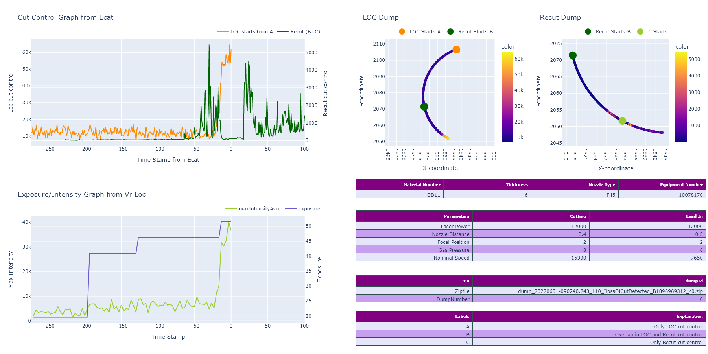
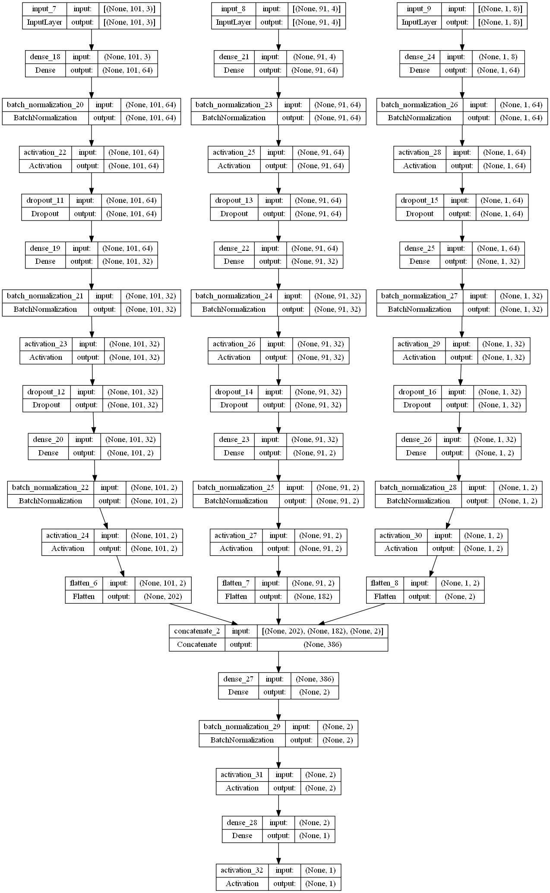
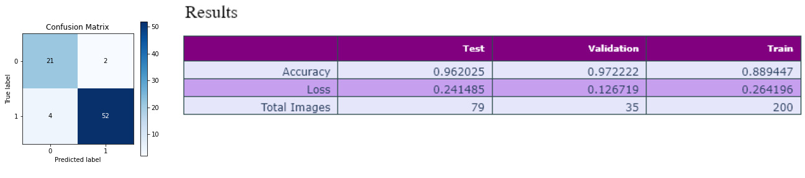

## Project: Loss of Cut Detection 

The whole project is divided into three phases. 

**Phase-1: Get data labeled**

|        Module         | Steps                                                        | Sub Steps                                                    |
| :-------------------: | ------------------------------------------------------------ | ------------------------------------------------------------ |
| Read H5 from zip file | Open zip file,  read H5 file, check for data points (setlimit=90 points at least) | Some zip files contains h5 files which have very few data points thus can't be analyzed. So we set limit and check for it. if points are less than 90, we discard that zip file. |
|     Create Charts     | Read LOC and recut data from H5, Sync the overlapped part, make graphs(4 in total) , merge three graphs in single charts  along with parameter values. | For plots, Graph1:use cut control values of LOC and Recut. Graph2: position coordinates X,Y with cut control values of LOC. Graph3: position X,Y with cut control values of Recut. Graph4: Exposure and Max Average Intensity from vision result data. |
|      Label data       | Upload these graphs to azure, Get the data from azure to label studio to get them labelled. | Export list of labels from label studio, join image with their respective zip file, move the zip file to three separate folder namely,  DumpTp (label-true positive), DumpFP (label-false positive) and DumpUnsure (label-Not Sure). |

Sample Image created in phase-1

**Phase-2: Training Pipeline**

|       Module        | Steps                                                        | Sub Steps                                                    |
| :-----------------: | :----------------------------------------------------------- | :----------------------------------------------------------- |
|      Get Data       | Unzip files from all three folders, get data from both H5 files (LOC and Recut data ) along with label and zip file name {'data': fold,'label':label,'ZipName': ZipName }, Make two separate list from this information one for training (from DumpTp and DumpFP) and One for Inference (from DumpUnsure). | Check for data points set limit, Check for multiple H5 files in single zip (should not be more than two.) |
| Structure Two lists | Read Ecat data for both LOC and Recut , Prepare it into three separate inputs [Cdata,Bdata,param], Add label and zipfile name to this [Cdata,Bdata,param,label,zipName] for each zip file. | Do it for each zipfile in the lists created in step 1. Cdata=[cutControl_LOC,sin(veloX,veloY),cos(veloX,veloY)], Bdata=[cutControl_LOC,cutControl_re,sin(veloX,veloY),cos(veloX,veloY)],param=parameter values |
|    Process Lists    | After collecting the multi-input per zip file we need to process it, adjust the shape of each input (size should be same), Normalize data, Covert it to tensor, Encode labels. | All the inputs should be resized to same size to feed it as an input to the model. Save the normalizing parameters to json to use at the time of inference. |
|     Build Model     | Create a multi-head input dense model, one head for each input type, Concatenate all three heads after adding some layers (dense and activation), Add two more dense layers, create final output. | Each head will be taking inputs Cdata,Bdata, param respectively. |
|     Train Model     | Split data in the training list into two parts, one for training phase another one for test phase, train and plot the results, save the model for inference time. Use the inference list data from DumpUnsure for the inference. | Train Input: [C_train,B_train,P_train], Test Input: [C_test, B_test, P_test] |

Model: 

Remark: input_7 represents C_train, input_8 represents B_train and input_9 represents P_train in the model architecture explained below.

Results:

**Phase-3: Inference**

| Module                | Steps                                                        | Sub Steps                                                    |
| --------------------- | ------------------------------------------------------------ | ------------------------------------------------------------ |
| Subscribe             | Use main file to subscribe to topic and get relative zip file | topic=icp/dumps/lossOfCutDetected                            |
| Process dump          | Once file is received, check if path_work is already empty, extract data from stream at the location path_work, read h5, check for empty file , make chart and save it in  extracted file. | All the details are same as that of phase -2                 |
| Make Prediction       | Preprocess the data read from h5 file first normalize and then format it, load the onxx model to make the prediction on formatted data, save the prediction along with input shape and prediction probability in json file to extracted stream | Normalizing parameters can be retrieve form saved json file. |
| Create Zip and upload | Since the extracted stream now contains data plot chart and prediction json file, zip it again and upload it to azure and after azure upload remove the zip file from path_work | Remove unzip file as well                                    |
| logger                | log all the information for references                       |                                                              |

