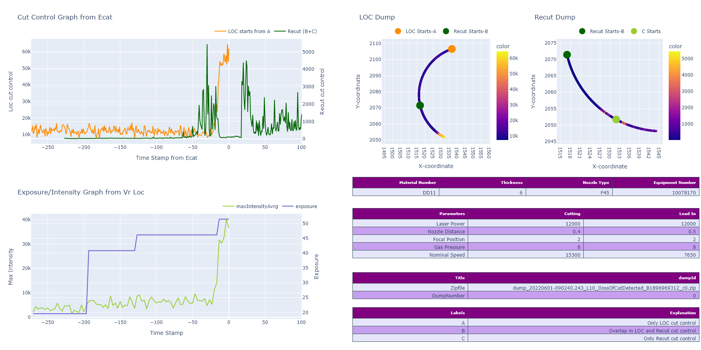

#  Project : LOC of Cut Detection

Loss of cut occurs when the laser cut sequence melting/blowout leads in a non-separating process.

Some contributors to force a loss of cut are well known:
•	Spontaneous: Bad grid state, polluted sheet surface, changing material characteristics, laser degrading, temperature, nozzle misaligned, nozzle worn
•	Forced: Reduced laser power, increased velocity, wrong nozzle 
Due to very high variance of different laser processes, it is hard to develop a generic loss of cut detector.
A system must be introduced that learns semi-automated from different laser cutting processes.

Data: When LOC happens we get the dumps(zip files) from the process which consist of parameters information, Ecat data and vision result data of both 'Loss of cut' 
and 'recut'. We majorly categories it in three categories A: real LOC cutcontrol values, B:overapped points for predicted LOC cutcontrol and C:real recut cutcontrol values.

##  TASKS : 

#### Task-1 : Upload the dumps on cloud and create a project on label Studio to label data

#### **Task-2 : To Train a Model(NN-1) from the labeled data and detect LOC**

## **AI Pipeline description:**

| Index     | FileName                  | Description                                                  | Task | Folder          |
| --------- | :------------------------ | ------------------------------------------------------------ | ---- | --------------- |
| **Task1** | >>>>>>>>>>>>>             | >>>>>>>>>>>>>>>>>>>>>>>>>>>>>>>>>>>>>>>>>>>>>>>>>>>>>>>>>>>>>>>>>>>>> | >>   | >>>>            |
| 1.        | H5Reader_00.py            | Read .h5 files                                               | 1, 2 | Modules         |
| 2.        | getH5forLS_01.py          | Unzip dumps, check for empty data, filter through more than two .h5 files in a single dump | 1    | Modules         |
| 3.        | DumpReader_02.py          | Get .h5 files from getH5LS_01.py and Synchronize LOC and Recut data, predict the cutcontrol and timestamp for synchronized LOC data, divide the data into three sequences (A,B,C) | 1,2  | DataPreparation |
| 4.        | PyPlot_03.py              | Get data from DumpReader_02.py and Create LOC, Recut , cutControl , MaxIntensity graphs | 1    | Visualization   |
| 5.        | mainSavePlots_04.py       | Get data and graphs from Pyplot+03.py, concatenate them together in single chart for each dump and save it in given location (run this file only, to get charts) | 1    | main            |
| 6.        | mainDash_04.py (optional) | Get graphs from PyPlot_03.py and create an interactive dashboard for each dump | 1    | Visualization   |
| 7.        | azure_upload_05.py        | Get the save images/charts and upload it on cloud            | 1    | Modules         |
| 8.        | joinLabels_07.py          | Get the exported labels sheet(csv) , check for repeated filenames, Join the labels with their respective filenames and save the processed excel sheet | 1    | labelStudio     |
| 9.        | labelToFolder_07.py       | Get excel sheet from joinLabels_06 and move the files according to their respective labels to three created data folders : DumpTP(label 0), DumpFP(label=1) and DumpUnsure(For test,label=2) | 1    | labelStudio     |
| **Task2** | >>>>>>>>>>>>>             | >>>>>>>>>>>>>>>>>>>>>>>>>>>>>>>>>>>>>>>>>>>>>>>>>>>>>>>>>>>>>>>>>>>> | >>   | >>>>>>>>>>      |
| 1.        | getH5_01.py               | unZip dumps , Check for more than 2 .h5 files in a dump, Join it with respective labels | 2    | Modules         |
| 2.        | InputData_03.py           | Get data from DumpReader_02.py, resample it for veloX and veloY and structure it in the format [Cdata,Bdata,param], where Cdata: [cutControl,sin,cos], Bdata=[locCut,reCut,sin,cos] and param has parameter values | 2    | DataPreparation |
| 3.        | balanceData_04.py         | Get formated data from InputData_03.py, balance it (same number of rows for all points in Cdata and dame for Bdata), normalize it  and split it into Train and Test data | 2    | DataPreparation |
| 4.        | models_05.py              | Create NN1 model                                             | 2    | ModelTraining   |
| 5.        | trainEvaluate_06.py       | Compile and fit model, create accuracy and loss plots, create accuracy table | 2    | ModelTraining   |
| 6.        | mainNN1_07.py             | Call all classes to prepare data, train model and predict labels. It also creates jsonfile for input data [Cdata,bdata,param,filename,label], for each dump and save it ,lastly convert keras model to ONNX | 2    | main            |
| 7.        | validateOnnx_08.py        | Read data from jsonfiles created by mainNN1_07.py and validate saved ONNX model | 2    | ModelTraining   |
| **mqtt**  | >>>>>>>>>>>>>>            | >>>>>>>>>>>>>>>>>>>>>>>>>>>>>>>>>>>>>>>>>>>>>>>>>>>>>>>>>>>>>>>>>>>>>> | >>   | >>>>>>>>>       |
| 1.        | mqtt_pub.py               | To publish file on mqtt                                      |      | mqtt            |
| 2.        | mqtt_sub.py               | To subscribe to mqtt                                         |      | mqtt            |

****

****

<u>**GitHub link :**</u> (Repo- chggo/Dump_processing , branch-features/neuralNet1)

https://git.bystronic.com/chggo/Dump_processing/tree/features/neuralNet1

****

**<u>Sample dumps:</u>**
This is an example where we can see loss of cut when machine is cutting.

****

**<u>Sample predicted dumps:</u>**

These are the predicted positions of LOC. We took into account the position coordinates and cutcotrol values which are used as color parameter to plot theses charts.

**<u>How synchronization works:</u>**

**Subtask:** To synchronize LOC cut control and Recut cut control data.

Since there exist a overlapped part where we have data for both LOC and Recut, so it is imporatnt to sync that part first and then use it to analyze if real LOC happened.

Method: 

1)  Consider (x,y) coordinates and cut control of LOC and Recut data. 

2)  For the part where LOC and recut data overlaps(B sequence), predict cut control values of LOC for each (x,y)  coordinate of recut data. 

3)  **In Between function** :Let p1,p2 are LOC coordinates and r1 is recut coordinate such that r1 lies in between p1 and p2. 

4)  **Predict function**: Once we check the 'in between' condition, predict the value of cut control for r1 point.
$$
cut1 +(\frac{norm(r1,p1)} { norm(p2,p1)})(cut2-cut1)
$$
**In between function:**

a) let p1, p2 and r1 has coordinates (x1,y1) , (x2,y2) and (x,y) resp. 

b) Find a point v orthogonal to p1 
$$
v=(\delta_y,\delta_x)
$$
c) Create a unit normal vector of v via l2 norm and multiple it with a threshold 'th'. 

d) Form a rectangle around p1 and p2 using 'v', with vertex (a1,a2,a3,a4) 

 e) Check if r1 lies in between the rectangle. 
 
Note: Since aspect ratio is not same in the graph, So it is difficult to catch orthogonality in this picture.

<u>**Sample charts:**</u>

This are the charts created from Task-1, which consist of 1) Cut Control Graph from Ecat: synced cut control values of both 'LOC' and 'Recut' 2) LOC Dump, Recut Dump: Positional(x,y) and cutcontrol values 3) Exposur/Intensity: Exposure and MaxIntensityAverage from vision result of LOC only. 4) Tables: It consist of File name and parameter settings.

**<u>Outliers Detection:</u>**

Before uploading dumps to cloud, we check it for 1) empty data 2) Repeated data 3) Outliers.
Outliers are detected by taking Mean, Median and standard deviation of all dumps together. Once we plot the data the extreame points can be calculated using Z-score.

<u>**Sample Model Accuracy and Loss on first run:**</u>

**<u>Model</u>**:

This is a multiInput Model. Here we pass three different types of Inputs 1) **Cdata**: from recut 2) **Bdata**: from overlap 3) **param**: the parameter setting for each dump.
We started with only Dense network(could be modified in future) and three heads which after some layers concatenated to produce a single output.

**<u>Dashboard View:</u>**

This is the dashboard view which is created for this project to visualize interactive charts for each dump.

