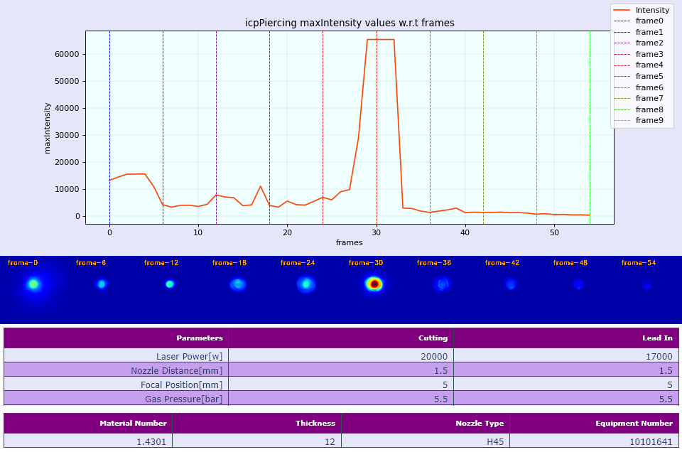

# icpPiercing
This pipeline is created to visualize icp piercing dumps. Each dump contains vision result data, images for each frame and parameters setting data.

To make this visualization, maxIntensity column form vision result data is plotted w.r.t. frames. Since we have image data available for each frame, thus ten frames with equal spacing are picked to visualize as maxIntensity progresses. Along with it, parameter setting used to create the dump is also provided to better analysis the dump. 

